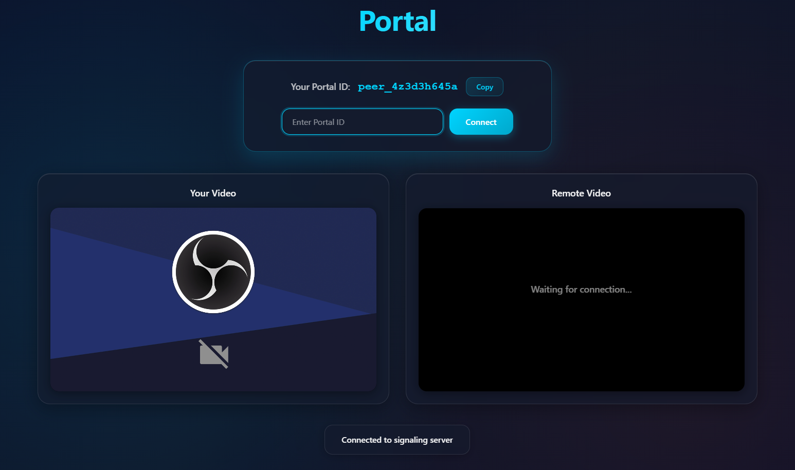

# Portal

**Portal is a peer-to-peer video chat web application built with WebRTC and JavaScript.**

[](https://github.com/ssnofall/portal)
[](https://react.dev/)
[](https://nodejs.org/)
[](https://www.gnu.org/licenses/gpl-3.0)
[](https://github.com/ssnofall/portal)




Portal enables direct audio and video communication between browsers using WebRTC, with a lightweight signaling server to facilitate peer discovery.

This project is currently **in progress** and will continue to evolve based on feedback and new feature requests.

## Project Goals

The primary goal of this project is to learn and demonstrate how to build a peer-to-peer web application using JavaScript and WebRTC.

## Features

- Real-time audio and video calling via WebRTC
- Unique peer identification (like a "phone number" for direct connections)
- Secure signaling server over WebSockets
- Self-signed SSL certificates for local HTTPS deployment (required by modern browsers for WebRTC)

## Tech Stack

- **Frontend**: React.js with Vite (served over HTTPS)
- **Backend**: Node.js server to serve the app over HTTPS
- **Signaling**: Secure WebSocket server (WSS) for peer matchmaking

## Getting Started

### Prerequisites

- [Node.js](https://nodejs.org/) (v14 or later recommended)

### Installation

1. Clone the repository:

```bash
git clone https://github.com/ssnofall/portal.git
cd portal
```
2. Install Dependencies
```bash
npm install              # Install Backend dependencies
cd client && npm install # Install React dependencies
cd ..
```
3. Create the required directories and files:
```bash
mkdir certs
touch .env
```
4. Generate SSL certificates (required for HTTPS):
```bash
cd certs
openssl req -nodes -new -x509 -keyout server.key -out server.cert -days 365
```
- You can press Enter for most prompts to accept the defaults.
- For Common Name, enter your IP address or `localhost` (e.g., `192.168.1.100` or `localhost`).

5. Configure your '.env' file. Replace the 'HOST' value with your machine's local IP address:
```bash
NODE_ENV=development
WEB_PORT=3000
SIGNALING_PORT=3001
HOST=192.168.1.100
```

### Running the App

**Development Mode:**
```bash
# Start the signaling server (WSS)
npm run portal:signal

# Start the express web server that serves the webpage (HTTPS)
npm run portal:web

# Start the React development server on localhost
cd client
npm run react:dev
```

**Production Mode:**
```bash
# Build the React app
cd client
npm run portal:build
cd ..

# Start servers
npm run portal:signal
npm run portal:web
```

**Note:** HTTPS is enabled by default. Both the web server and signaling server use certificates from the `certs/` directory. The React dev server (Vite) will also use HTTPS with the same certificates.

---

## Contributing
- Contributions, bug reports, and feature requests are welcome!

- Feel free to open an issue or submit a pull request.

---

## License

This project is licensed under the GNU General Public License v3.0
